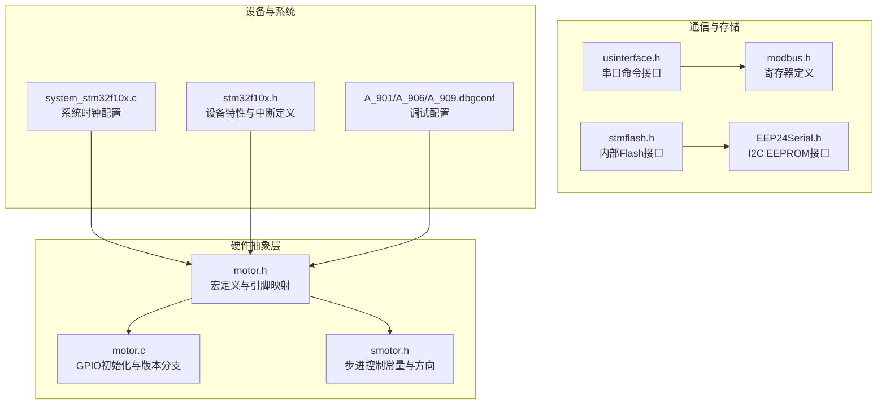
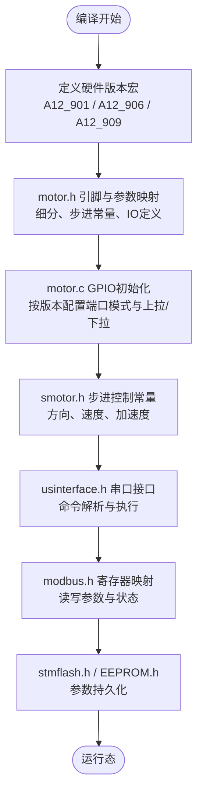
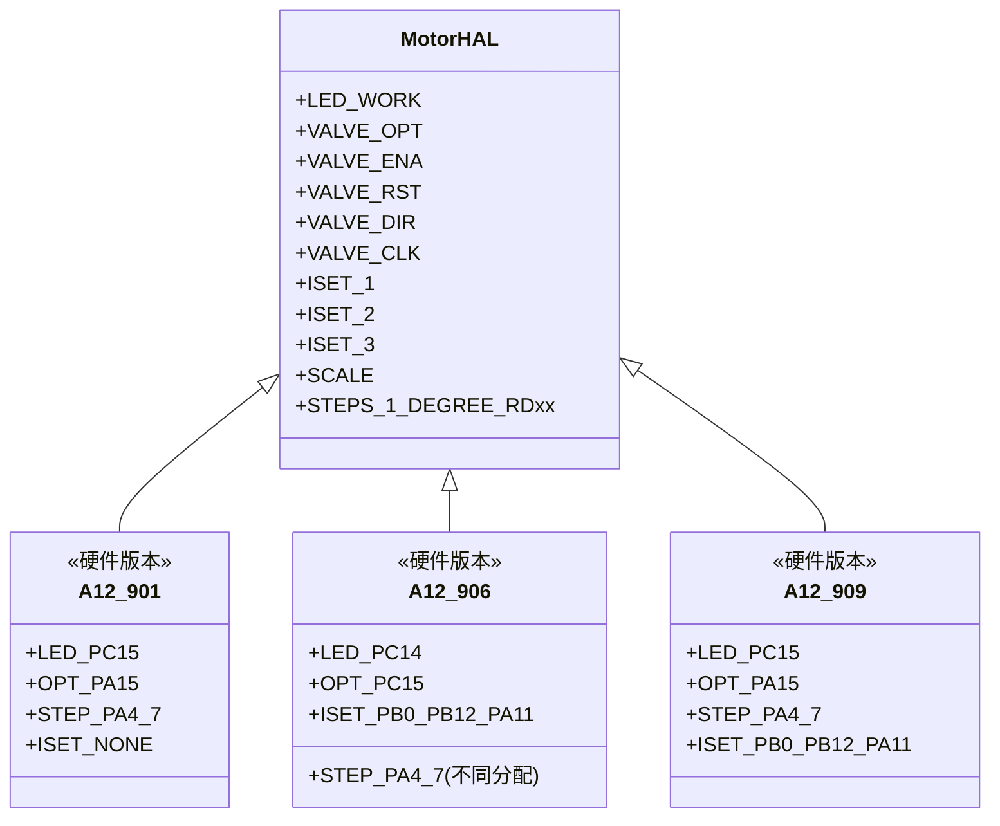
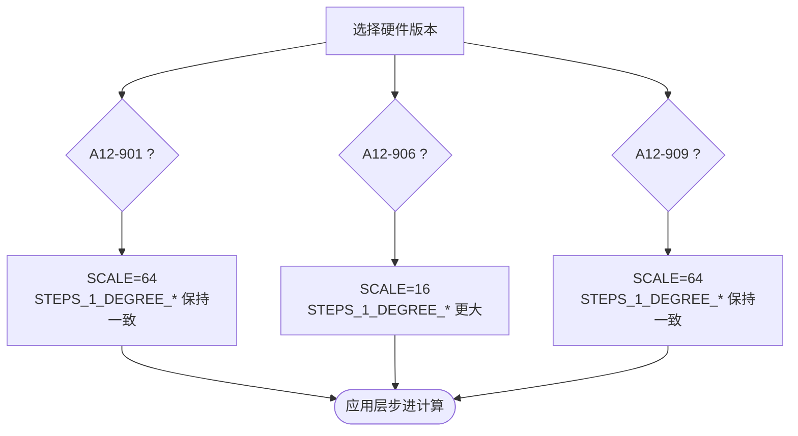
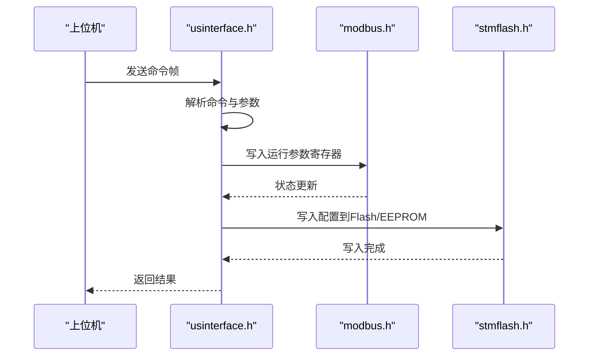
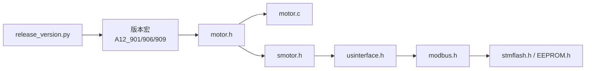

# 硬件版本支持

<cite>
**本文引用的文件**
- [motor.h](file://SRC/HARDWARE/motor/motor.h)
- [motor.c](file://SRC/HARDWARE/motor/motor.c)
- [smotor.h](file://SRC/HARDWARE/motor/smotor.h)
- [usinterface.h](file://SRC/HARDWARE/usinterface/usinterface.h)
- [modbus.h](file://SRC/HARDWARE/modbus/modbus.h)
- [stmflash.h](file://SRC/HARDWARE/stmFlash/stmflash.h)
- [EEP24Serial.h](file://SRC/HARDWARE/EEPROM/EEP24Serial.h)
- [system_stm32f10x.c](file://SRC/CMSIS/DeviceSupport/system_stm32f10x.c)
- [stm32f10x.h](file://SRC/CMSIS/DeviceSupport/stm32f10x.h)
- [A_901.dbgconf](file://USER/DebugConfig/A_901_STM32F103C8_1.0.0.dbgconf)
- [A_906.dbgconf](file://USER/DebugConfig/A_906_STM32F103C8_1.0.0.dbgconf)
- [A_909.dbgconf](file://USER/DebugConfig/A_909_STM32F103C8_1.0.0.dbgconf)
- [release_version.py](file://release_version.py)
</cite>

## 目录
1. [简介](#简介)
2. [项目结构](#项目结构)
3. [核心组件](#核心组件)
4. [架构总览](#架构总览)
5. [详细组件分析](#详细组件分析)
6. [依赖分析](#依赖分析)
7. [性能考量](#性能考量)
8. [故障排查指南](#故障排查指南)
9. [结论](#结论)
10. [附录](#附录)

## 简介
本文件面向通用开关器项目的硬件版本支持，系统性说明A12-901、A12-906、A12-909三种硬件版本的技术规格与功能差异，涵盖IO接口、细分与步进参数、电流设置引脚、通信接口等关键配置。同时阐述硬件抽象层通过宏定义实现“同一套软件代码适配多硬件版本”的配置驱动机制，并提供硬件版本对比表与选型建议，帮助用户基于应用场景、成本与性能进行合理选择。

## 项目结构
围绕硬件版本差异的关键代码集中在以下模块：
- 电机与步进控制：motor.h/c、smotor.h
- 串口与用户接口：usinterface.h
- Modbus寄存器定义：modbus.h
- 存储与EEPROM：stmflash.h、EEP24Serial.h
- 设备与系统时钟：system_stm32f10x.c、stm32f10x.h
- 调试配置：A_901/A_906/A_909调试配置文件
- 构建与版本映射：release_version.py

**图表来源**
- [motor.h](file://SRC/HARDWARE/motor/motor.h)
- [motor.c](file://SRC/HARDWARE/motor/motor.c)
- [smotor.h](file://SRC/HARDWARE/motor/smotor.h)
- [usinterface.h](file://SRC/HARDWARE/usinterface/usinterface.h)
- [modbus.h](file://SRC/HARDWARE/modbus/modbus.h)
- [stmflash.h](file://SRC/HARDWARE/stmFlash/stmflash.h)
- [EEP24Serial.h](file://SRC/HARDWARE/EEPROM/EEP24Serial.h)
- [system_stm32f10x.c](file://SRC/CMSIS/DeviceSupport/system_stm32f10x.c)
- [stm32f10x.h](file://SRC/CMSIS/DeviceSupport/stm32f10x.h)
- [A_901.dbgconf](file://USER/DebugConfig/A_901_STM32F103C8_1.0.0.dbgconf)
- [A_906.dbgconf](file://USER/DebugConfig/A_906_STM32F103C8_1.0.0.dbgconf)
- [A_909.dbgconf](file://USER/DebugConfig/A_909_STM32F103C8_1.0.0.dbgconf)

**章节来源**
- [motor.h](file://SRC/HARDWARE/motor/motor.h)
- [motor.c](file://SRC/HARDWARE/motor/motor.c)
- [system_stm32f10x.c](file://SRC/CMSIS/DeviceSupport/system_stm32f10x.c)
- [stm32f10x.h](file://SRC/CMSIS/DeviceSupport/stm32f10x.h)
- [A_901.dbgconf](file://USER/DebugConfig/A_901_STM32F103C8_1.0.0.dbgconf)
- [A_906.dbgconf](file://USER/DebugConfig/A_906_STM32F103C8_1.0.0.dbgconf)
- [A_909.dbgconf](file://USER/DebugConfig/A_909_STM32F103C8_1.0.0.dbgconf)
- [release_version.py](file://release_version.py)

## 核心组件
- 硬件抽象层（HAL）：通过在motor.h中使用宏定义（如A12_901、A12_906、A12_909）对引脚、细分、步进参数进行编译期裁剪与配置，确保同一套软件逻辑可适配不同硬件版本。
- 电机与步进控制：motor.c负责GPIO初始化；smotor.h定义步进控制常量及方向相关宏，配合motor.h中的引脚映射实现统一的运动控制接口。
- 通信与存储：usinterface.h提供串口命令解析接口；modbus.h定义Modbus寄存器地址；stmflash.h与EEP24Serial.h分别提供内部Flash与I2C EEPROM访问。
- 设备与系统：system_stm32f10x.c与stm32f10x.h提供系统时钟与设备特性配置，保证不同硬件版本在相同外设基址与中断定义下运行。

**章节来源**
- [motor.h](file://SRC/HARDWARE/motor/motor.h)
- [motor.c](file://SRC/HARDWARE/motor/motor.c)
- [smotor.h](file://SRC/HARDWARE/motor/smotor.h)
- [usinterface.h](file://SRC/HARDWARE/usinterface/usinterface.h)
- [modbus.h](file://SRC/HARDWARE/modbus/modbus.h)
- [stmflash.h](file://SRC/HARDWARE/stmFlash/stmflash.h)
- [EEP24Serial.h](file://SRC/HARDWARE/EEPROM/EEP24Serial.h)
- [system_stm32f10x.c](file://SRC/CMSIS/DeviceSupport/system_stm32f10x.c)
- [stm32f10x.h](file://SRC/CMSIS/DeviceSupport/stm32f10x.h)

## 架构总览
硬件版本差异通过“宏定义 + 条件编译”在编译阶段完成配置融合，运行时无需额外分支判断，从而降低开销并提升可维护性。

**图表来源**
- [motor.h](file://SRC/HARDWARE/motor/motor.h)
- [motor.c](file://SRC/HARDWARE/motor/motor.c)
- [smotor.h](file://SRC/HARDWARE/motor/smotor.h)
- [usinterface.h](file://SRC/HARDWARE/usinterface/usinterface.h)
- [modbus.h](file://SRC/HARDWARE/modbus/modbus.h)
- [stmflash.h](file://SRC/HARDWARE/stmFlash/stmflash.h)
- [EEP24Serial.h](file://SRC/HARDWARE/EEPROM/EEP24Serial.h)

## 详细组件分析

### 硬件版本差异与引脚映射
- A12-901与A12-909共享大部分引脚映射，均使用PC15作为工作指示灯，PA15作为阀门光耦输入，PA4~PA7作为步进控制信号；A12-909额外使用PB0、PB12、PA11作为电流设置引脚（ISET_1~ISET_3），以支持更精细的电流调节。
- A12-906的引脚布局不同，LED使用PC14，阀门光耦输入PC15，但步进控制引脚分配与A12-901/909不同，且其电流设置引脚组合也与901/909不同。

**图表来源**
- [motor.h](file://SRC/HARDWARE/motor/motor.h)
- [motor.c](file://SRC/HARDWARE/motor/motor.c)

**章节来源**
- [motor.h](file://SRC/HARDWARE/motor/motor.h)
- [motor.c](file://SRC/HARDWARE/motor/motor.c)

### 细分与步进参数
- A12-901与A12-909采用相同的细分策略（当前为64细分），对应的每度步数常量一致，适用于高精度定位场景。
- A12-906采用较低细分（16细分），在相同步进电机下，其每度步数更大，适合对精度要求相对较低或追求更高转矩的应用。

**图表来源**
- [motor.h](file://SRC/HARDWARE/motor/motor.h)

**章节来源**
- [motor.h](file://SRC/HARDWARE/motor/motor.h)

### 通信与存储接口
- 串口命令接口：usinterface.h提供命令注册、解析与超时处理，支持用户交互与调试。
- Modbus寄存器：modbus.h定义了控制寄存器、状态寄存器与运行参数寄存器，便于上位机读写配置与监控。
- 存储：stmflash.h提供内部Flash读写接口；EEP24Serial.h封装I2C EEPROM访问，用于参数与校准数据持久化。

**图表来源**
- [usinterface.h](file://SRC/HARDWARE/usinterface/usinterface.h)
- [modbus.h](file://SRC/HARDWARE/modbus/modbus.h)
- [stmflash.h](file://SRC/HARDWARE/stmFlash/stmflash.h)
- [EEP24Serial.h](file://SRC/HARDWARE/EEPROM/EEP24Serial.h)

**章节来源**
- [usinterface.h](file://SRC/HARDWARE/usinterface/usinterface.h)
- [modbus.h](file://SRC/HARDWARE/modbus/modbus.h)
- [stmflash.h](file://SRC/HARDWARE/stmFlash/stmflash.h)
- [EEP24Serial.h](file://SRC/HARDWARE/EEPROM/EEP24Serial.h)

### 系统时钟与设备特性
- system_stm32f10x.c提供系统时钟切换与频率配置，支持多种主频设定；stm32f10x.h定义设备特性与中断编号，确保不同密度/系列的STM32F10x设备在统一头文件下编译。

**章节来源**
- [system_stm32f10x.c](file://SRC/CMSIS/DeviceSupport/system_stm32f10x.c)
- [stm32f10x.h](file://SRC/CMSIS/DeviceSupport/stm32f10x.h)

### 调试配置一致性
- A12-901/906/909的调试配置文件（dbgconf）在寄存器层面保持一致，主要用于调试模式下的外设停止行为控制，不影响硬件版本差异的编译期配置。

**章节来源**
- [A_901.dbgconf](file://USER/DebugConfig/A_901_STM32F103C8_1.0.0.dbgconf)
- [A_906.dbgconf](file://USER/DebugConfig/A_906_STM32F103C8_1.0.0.dbgconf)
- [A_909.dbgconf](file://USER/DebugConfig/A_909_STM32F103C8_1.0.0.dbgconf)

## 依赖分析
- 版本宏与编译期选择：motor.h通过A12_901/A12_906/A12_909宏决定引脚映射、细分与步进常量，motor.c据此初始化GPIO。
- 步进控制与方向：smotor.h提供方向与步进控制常量，与motor.h的引脚映射协同工作。
- 通信与存储：usinterface.h与modbus.h解耦，存储由stmflash.h与EEP24Serial.h提供，彼此独立。
- 构建与版本映射：release_version.py定义了A/O/B/C系列与901/906/909的映射关系，用于构建不同版本固件。

**图表来源**
- [motor.h](file://SRC/HARDWARE/motor/motor.h)
- [motor.c](file://SRC/HARDWARE/motor/motor.c)
- [smotor.h](file://SRC/HARDWARE/motor/smotor.h)
- [usinterface.h](file://SRC/HARDWARE/usinterface/usinterface.h)
- [modbus.h](file://SRC/HARDWARE/modbus/modbus.h)
- [stmflash.h](file://SRC/HARDWARE/stmFlash/stmflash.h)
- [EEP24Serial.h](file://SRC/HARDWARE/EEPROM/EEP24Serial.h)
- [release_version.py](file://release_version.py)

**章节来源**
- [release_version.py](file://release_version.py)

## 性能考量
- 细分与精度：A12-901/909的64细分带来更高分辨率与更平滑运动，适合高精度定位；A12-906的16细分在同等步进电机下步数更大，可能牺牲部分分辨率以换取更高转矩与更快响应。
- 电流设置：A12-909具备三路电流设置引脚，可实现更精细的电流调节与多通道控制，适合复杂负载场景。
- 通信与存储：串口命令解析与Modbus寄存器访问均为轻量级实现，结合内部Flash与EEPROM持久化，满足参数保存与快速读取需求。

[本节为通用性能讨论，不直接分析具体文件]

## 故障排查指南
- 引脚配置异常：若发现LED或步进控制不生效，检查对应版本宏是否正确启用，确认motor.c中的GPIO初始化分支与motor.h中的引脚映射一致。
- 细分与步进不匹配：若出现定位偏差，核对motor.h中的SCALE与STEPS_1_DEGREE_*常量是否与硬件版本一致。
- 通信问题：通过usinterface.h提供的命令解析接口验证串口通信链路；检查modbus.h中寄存器地址与读写权限。
- 参数丢失：确认stmflash.h与EEP24Serial.h的写入流程与存储介质可用性。

**章节来源**
- [motor.h](file://SRC/HARDWARE/motor/motor.h)
- [motor.c](file://SRC/HARDWARE/motor/motor.c)
- [usinterface.h](file://SRC/HARDWARE/usinterface/usinterface.h)
- [modbus.h](file://SRC/HARDWARE/modbus/modbus.h)
- [stmflash.h](file://SRC/HARDWARE/stmFlash/stmflash.h)
- [EEP24Serial.h](file://SRC/HARDWARE/EEPROM/EEP24Serial.h)

## 结论
通过宏定义与条件编译，通用开关器实现了“一套软件代码 + 多种硬件版本”的高效适配。A12-901/909侧重高精度与多电流设置，A12-906强调简化与高转矩。结合构建映射与硬件抽象层设计，用户可根据应用场景灵活选择硬件版本并在不改动业务逻辑的前提下完成部署。

[本节为总结性内容，不直接分析具体文件]

## 附录

### 硬件版本对比表
- 引脚与功能
  - LED：A12-901/909使用PC15；A12-906使用PC14
  - 阀门光耦：A12-901/909使用PA15；A12-906使用PC15
  - 步进控制：三者均有PA4~PA7（A12-906引脚分配不同）
  - 电流设置：仅A12-909具备PB0/PB12/PA11三路ISET；A12-906具备两路ISET；A12-901无ISET
- 细分与步进
  - A12-901/909：64细分，STEPS_1_DEGREE_*一致
  - A12-906：16细分，STEPS_1_DEGREE_*更大
- 通信与存储
  - 串口命令接口：usinterface.h
  - Modbus寄存器：modbus.h
  - 存储：内部Flash与I2C EEPROM

**章节来源**
- [motor.h](file://SRC/HARDWARE/motor/motor.h)
- [motor.c](file://SRC/HARDWARE/motor/motor.c)
- [usinterface.h](file://SRC/HARDWARE/usinterface/usinterface.h)
- [modbus.h](file://SRC/HARDWARE/modbus/modbus.h)
- [stmflash.h](file://SRC/HARDWARE/stmFlash/stmflash.h)
- [EEP24Serial.h](file://SRC/HARDWARE/EEPROM/EEP24Serial.h)

### 选型指南
- 高精度定位：优先A12-901/909（64细分）
- 简化布线与成本敏感：A12-906（16细分，ISET较少）
- 多通道精细电流控制：A12-909（三路ISET）
- 通信与参数持久化：统一使用usinterface.h与modbus.h，结合stmflash.h/EEP24Serial.h

**章节来源**
- [motor.h](file://SRC/HARDWARE/motor/motor.h)
- [usinterface.h](file://SRC/HARDWARE/usinterface/usinterface.h)
- [modbus.h](file://SRC/HARDWARE/modbus/modbus.h)
- [stmflash.h](file://SRC/HARDWARE/stmFlash/stmflash.h)
- [EEP24Serial.h](file://SRC/HARDWARE/EEPROM/EEP24Serial.h)