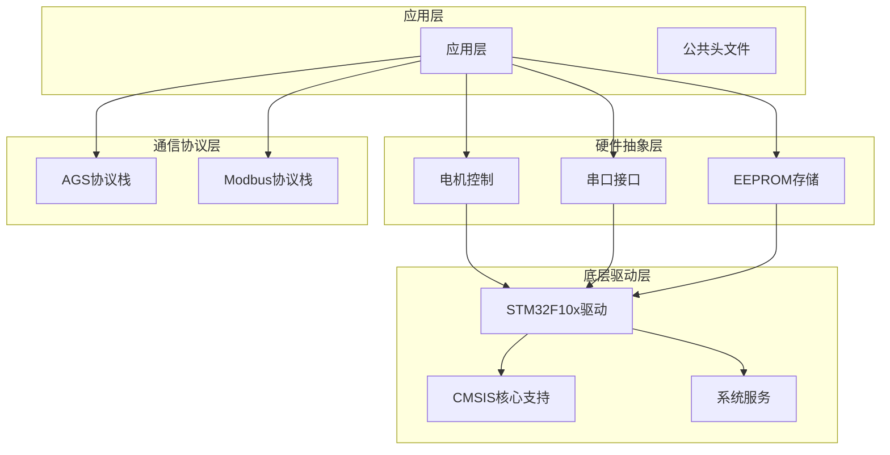
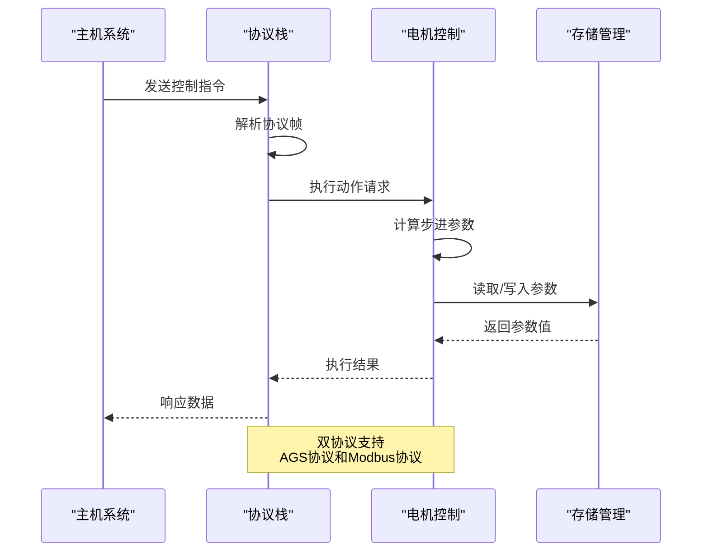
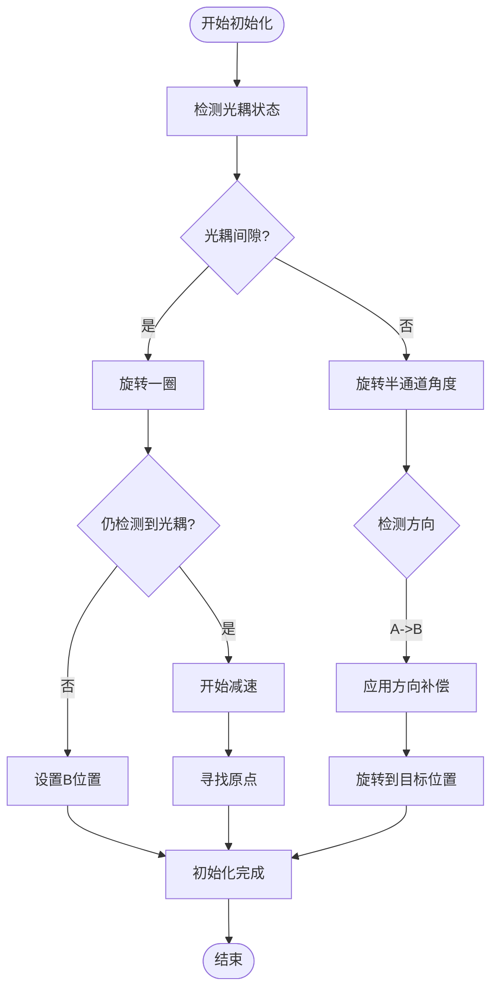
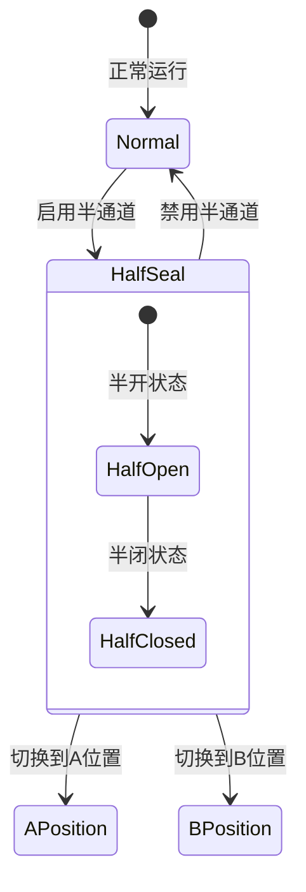
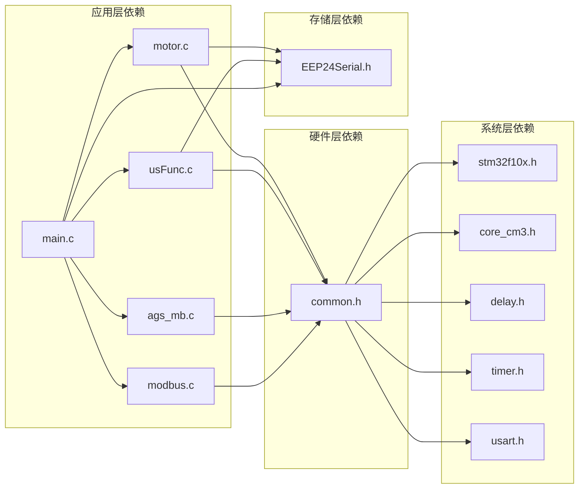
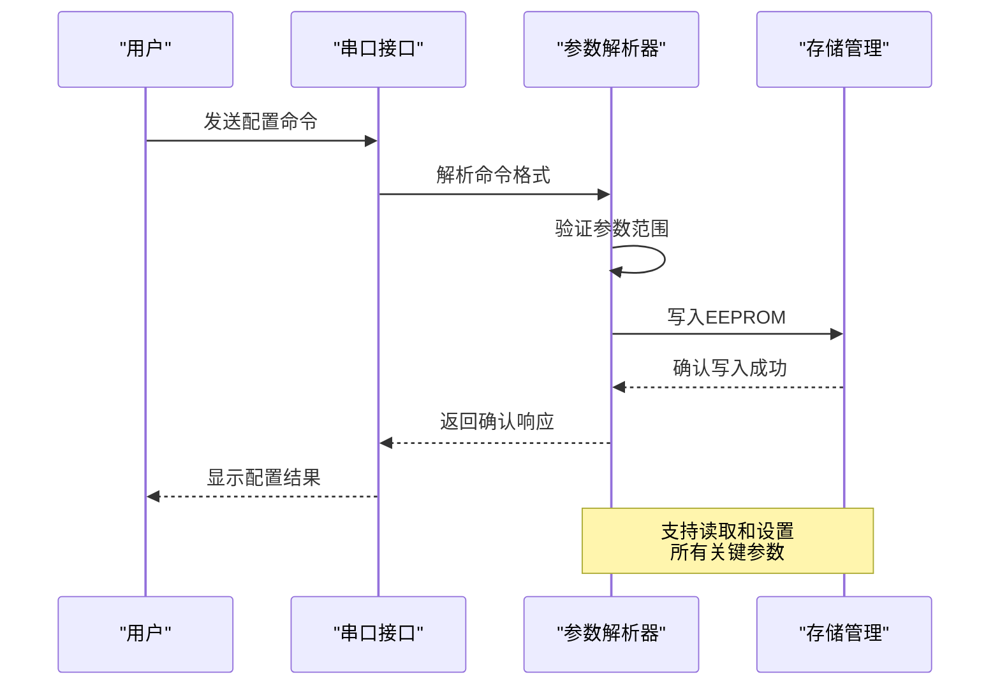

# 系统特性总览

<cite>
**本文档引用的文件**
- [main.c](file://SRC/APP/main.c)
- [main.h](file://SRC/APP/main.h)
- [motor.c](file://SRC/HARDWARE/motor/motor.c)
- [motor.h](file://SRC/HARDWARE/motor/motor.h)
- [ags_mb.c](file://SRC/HARDWARE/ags_mb/ags_mb.c)
- [modbus.c](file://SRC/HARDWARE/modbus/modbus.c)
- [usFunc.c](file://SRC/HARDWARE/usinterface/usFunc.c)
- [common.h](file://SRC/APP/common.h)
- [QHF_v1.3.1修改说明.md](file://Doc/QHF_v1.3.1修改说明.md)
</cite>

## 目录
1. [简介](#简介)
2. [项目结构](#项目结构)
3. [核心组件](#核心组件)
4. [架构总览](#架构总览)
5. [详细组件分析](#详细组件分析)
6. [依赖关系分析](#依赖关系分析)
7. [性能考虑](#性能考虑)
8. [故障保护机制](#故障保护机制)
9. [参数远程配置](#参数远程配置)
10. [特性对比与功能列表](#特性对比与功能列表)
11. [结论](#结论)

## 简介
通用开关器项目是一个基于STM32F10x系列微控制器的多通道阀门控制系统，支持3-16通道的智能控制。系统采用双协议通信架构，同时支持AGS协议和Modbus协议，具备完善的参数远程配置能力、智能原点寻找算法、方向补偿机制、半通道密封功能以及多重超时保护机制。系统还提供了丰富的故障保护功能，包括急停、通信异常处理和硬件故障检测等安全特性。

## 项目结构
项目采用典型的分层架构设计，主要分为应用层、硬件抽象层和底层驱动层：



**图表来源**
- [main.c:433-494](file://SRC/APP/main.c#L433-L494)
- [common.h:155-169](file://SRC/APP/common.h#L155-L169)

**章节来源**
- [main.c:433-494](file://SRC/APP/main.c#L433-L494)
- [common.h:155-169](file://SRC/APP/common.h#L155-L169)

## 核心组件
系统包含以下核心组件：

### 1. 主控系统
- **主控制器**: STM32F10x系列微控制器
- **时钟系统**: 72MHz系统时钟配置
- **延时系统**: 基于SysTick的精确延时
- **定时器系统**: TIM2和TIM4用于脉冲控制和计时

### 2. 电机控制系统
- **步进电机驱动**: 采用脉冲+方向控制方式
- **细分控制**: 支持64细分（A12-901/909）和16细分（A12-906）
- **加减速控制**: 独立的加减速参数配置
- **位置反馈**: 光耦传感器检测原点和端点

### 3. 通信系统
- **串口通信**: USART2和USART3双串口
- **485/232转换**: 自动收发切换控制
- **协议栈**: AGS协议和Modbus协议双栈支持

### 4. 存储系统
- **EEPROM**: I2C接口EEPROM存储参数
- **参数持久化**: 关键参数自动保存到非易失存储器

**章节来源**
- [motor.c:4-68](file://SRC/HARDWARE/motor/motor.c#L4-L68)
- [main.c:442-448](file://SRC/APP/main.c#L442-L448)
- [motor.h:100-148](file://SRC/HARDWARE/motor/motor.h#L100-L148)

## 架构总览
系统采用模块化设计，各模块职责清晰，耦合度低：



**图表来源**
- [main.c:478-493](file://SRC/APP/main.c#L478-L493)
- [ags_mb.c:426-473](file://SRC/HARDWARE/ags_mb/ags_mb.c#L426-L473)
- [modbus.c:469-517](file://SRC/HARDWARE/modbus/modbus.c#L469-L517)

## 详细组件分析

### 智能原点寻找算法
系统实现了高效的原点寻找算法，通过光耦传感器和步进电机配合实现精确的原点定位：



**图表来源**
- [motor.c:73-268](file://SRC/HARDWARE/motor/motor.c#L73-L268)
- [motor.c:356-371](file://SRC/HARDWARE/motor/motor.c#L356-L371)

**章节来源**
- [motor.c:73-268](file://SRC/HARDWARE/motor/motor.c#L73-L268)
- [motor.c:356-371](file://SRC/HARDWARE/motor/motor.c#L356-L371)

### 方向补偿机制
系统提供±0.1度精度的方向补偿功能，通过步进电机细分实现精确的角度控制：

| 补偿类型 | 精度 | 实现方式 | 应用场景 |
|---------|------|----------|----------|
| 原点补偿 | 1度 | 通过固定步数计算 | 校正机械零点偏差 |
| 方向补偿 | 0.1度 | 通过细分步数计算 | 校正旋转方向误差 |
| 半通道补偿 | 0.5度 | 通过半步进实现 | 特殊密封需求 |

**章节来源**
- [motor.h:113-148](file://SRC/HARDWARE/motor/motor.h#L113-L148)
- [motor.c:295-317](file://SRC/HARDWARE/motor/motor.c#L295-L317)

### 半通道密封功能
半通道密封功能允许阀门在A、B两端之间实现中间位置密封，满足特殊工艺需求：



**图表来源**
- [motor.c:164-202](file://SRC/HARDWARE/motor/motor.c#L164-L202)
- [usFunc.c:571-599](file://SRC/HARDWARE/usinterface/usFunc.c#L571-L599)

**章节来源**
- [motor.c:164-202](file://SRC/HARDWARE/motor/motor.c#L164-L202)
- [usFunc.c:571-599](file://SRC/HARDWARE/usinterface/usFunc.c#L571-L599)

### 超时保护机制
系统实现多层次的超时保护机制，防止电机长时间堵转损坏：

| 保护类型 | 触发条件 | 动作 | 恢复方式 |
|---------|----------|------|----------|
| 单次运行超时 | 运行时间超过5秒 | 停止电机，设置错误状态 | 15秒后自动解锁 |
| 初始化超时 | 初始化时间超过2圈 | 停止电机，设置错误状态 | 15秒后自动解锁 |
| 通信超时 | 串口接收超时 | 关闭接收中断 | 重新初始化串口 |

**章节来源**
- [main.c:70-202](file://SRC/APP/main.c#L70-L202)
- [motor.c:376-462](file://SRC/HARDWARE/motor/motor.c#L376-L462)

## 依赖关系分析



**图表来源**
- [main.c:162-169](file://SRC/APP/main.c#L162-L169)
- [common.h:155-169](file://SRC/APP/common.h#L155-L169)

**章节来源**
- [main.c:162-169](file://SRC/APP/main.c#L162-L169)
- [common.h:155-169](file://SRC/APP/common.h#L155-L169)

## 性能考虑
系统在性能方面采用了多项优化措施：

### 1. 通信性能优化
- **波特率支持**: 9600/19200/38400bps自适应
- **帧间隔优化**: T1.5帧间隔检测，避免总线冲突
- **CRC校验**: 快速CRC16校验，确保数据完整性

### 2. 控制性能优化
- **细分控制**: 64细分提供更高分辨率
- **加减速优化**: 独立加减速参数，提升运动平滑性
- **实时性保证**: 10kHz计数频率，确保控制精度

### 3. 存储性能优化
- **参数缓存**: 关键参数内存缓存，减少EEPROM访问
- **批量写入**: 批量参数写入，提高效率
- **掉电保护**: 关键参数自动保存，防止数据丢失

## 故障保护机制

### 急停功能
系统实现多重急停保护机制：

```mermaid
flowchart TD
Emergency([急停触发]) --> StopMotor["立即停止电机"]
StopMotor --> DisablePower["断开电机电源"]
DisablePower --> ResetSystem["系统复位"]
ResetSystem --> CheckFault["检查故障原因"]
CheckFault --> FaultHandled{"故障已处理?"}
FaultHandled --> |是| ResumeOperation["恢复运行"]
FaultHandled --> |否| ManualIntervention["人工干预"]
ResumeOperation --> NormalOperation["正常运行"]
ManualIntervention --> [*]
NormalOperation --> [*]
```

**图表来源**
- [main.c:180-201](file://SRC/APP/main.c#L180-L201)
- [motor.c:356-371](file://SRC/HARDWARE/motor/motor.c#L356-L371)

### 通信异常处理
系统具备完善的通信异常检测和处理能力：

| 异常类型 | 检测方式 | 处理策略 | 恢复机制 |
|---------|----------|----------|----------|
| CRC校验错误 | CRC16校验失败 | 发送错误响应 | 自动重传 |
| 帧格式错误 | 帧长度不匹配 | 忽略无效帧 | 等待新帧 |
| 地址冲突 | 多设备同时响应 | 选择最高优先级 | 重新初始化 |
| 通信超时 | 无响应超时 | 关闭接收中断 | 串口复位 |

**章节来源**
- [ags_mb.c:159-179](file://SRC/HARDWARE/ags_mb/ags_mb.c#L159-L179)
- [modbus.c:167-186](file://SRC/HARDWARE/modbus/modbus.c#L167-L186)

### 硬件故障检测
系统集成多种硬件故障检测功能：

- **过流保护**: 通过电流检测防止电机过载
- **过热保护**: 温度监控防止器件过热
- **缺相检测**: 检测电机绕组异常
- **电源异常**: 监控供电电压稳定性

## 参数远程配置

### 串口配置流程
系统提供完整的串口参数配置能力：



**图表来源**
- [usFunc.c:644-671](file://SRC/HARDWARE/usinterface/usFunc.c#L644-L671)
- [main.c:222-429](file://SRC/APP/main.c#L222-L429)

### 支持的配置参数
系统支持以下参数的远程配置：

| 参数类别 | 参数名称 | 范围 | 默认值 | 配置命令 |
|---------|----------|------|--------|----------|
| 基础参数 | 地址 | 0-63 | 1 | ADDR |
| 基础参数 | 通道数 | 3-16 | 10 | CNT |
| 通信参数 | 波特率 | 9600/19200/38400 | 9600 | BDR |
| 运行参数 | 速度 | 20-200RPM | 20 | SPD |
| 运行参数 | 减速比 | 1/4/10/16/20 | 4 | RDCR |
| 运行参数 | 半通道 | 0/1 | 0 | HALF |
| 运行参数 | 原点补偿 | 0-255度 | 5 | FIXO |
| 运行参数 | 方向补偿 | 0-255(0.1度) | 0 | FIXG |
| 运行参数 | IO控制 | 0/1 | 0 | IOE |
| 运行参数 | 电流设置 | 0-4 | 0 | ISET |
| 运行参数 | 老化间隔 | 0-255秒 | 5 | INT |
| 用户参数 | 序列号 | 5字节 | 0 | SN |
| 用户参数 | 切换次数 | 0-2³² | 0 | MOVES |
| 系统参数 | 回复方式 | 0-3 | 0 | REPLY |
| 系统参数 | 协议类型 | AGS/MODBUS | AGS | PRTCL |

**章节来源**
- [usFunc.c:753-800](file://SRC/HARDWARE/usinterface/usFunc.c#L753-L800)
- [main.h:127-189](file://SRC/APP/main.h#L127-L189)

## 特性对比与功能列表

### 协议特性对比

| 特性 | AGS协议 | Modbus协议 |
|------|---------|------------|
| 通信方式 | 串口通信 | 串口/网络 |
| 地址范围 | 0-63 | 1-247 |
| 功能码 | 03/06 | 03/06/10 |
| 数据格式 | 自定义帧 | 标准Modbus帧 |
| 速率支持 | 9600/19200/38400 | 9600/19200/38400 |
| 广播支持 | 是 | 是 |
| 错误处理 | 异常码 | 标准错误码 |
| 点检功能 | INSP指令 | 寄存器读取 |
| 老化模式 | 地址64 | 工厂模式 |

### 系统功能特性列表

#### 核心控制功能
- ✅ 多通道阀门控制（3-16通道）
- ✅ 智能原点寻找算法
- ✅ 方向补偿机制（±0.1度精度）
- ✅ 半通道密封功能
- ✅ 超时保护机制

#### 通信协议支持
- ✅ AGS协议（基于Modbus魔改）
- ✅ Modbus RTU协议
- ✅ 双协议并行支持
- ✅ 自动协议识别

#### 参数配置功能
- ✅ 串口远程配置
- ✅ 参数范围验证
- ✅ 参数持久化存储
- ✅ 在线参数修改

#### 故障保护功能
- ✅ 急停功能
- ✅ 通信异常处理
- ✅ 硬件故障检测
- ✅ 自动故障恢复

#### 用户界面功能
- ✅ 点检模式（INSP）
- ✅ 参数查询/设置
- ✅ LED状态指示
- ✅ 调试信息输出

**章节来源**
- [QHF_v1.3.1修改说明.md:18-47](file://Doc/QHF_v1.3.1修改说明.md#L18-L47)
- [QHF_v1.3.1修改说明.md:163-170](file://Doc/QHF_v1.3.1修改说明.md#L163-L170)

## 结论
通用开关器项目是一个功能完备、性能可靠的多通道阀门控制系统。系统通过双协议通信架构、智能原点寻找算法、精密的方向补偿机制和完善的保护体系，为工业自动化应用提供了稳定可靠的技术解决方案。

### 主要优势
1. **技术先进性**: 采用步进电机精密控制技术和双协议通信架构
2. **功能完整性**: 提供从基础控制到高级配置的完整功能集
3. **安全性保障**: 多层次保护机制确保系统运行安全
4. **扩展性强**: 模块化设计便于功能扩展和维护升级

### 应用价值
该系统适用于各种需要精确阀门控制的工业场景，包括但不限于：
- 化工管道控制系统
- 石油天然气输送系统
- 电力系统阀门控制
- 制药设备自动化
- 实验室精密控制设备

通过持续的功能优化和技术升级，通用开关器项目将继续为工业自动化领域提供高质量的控制解决方案。