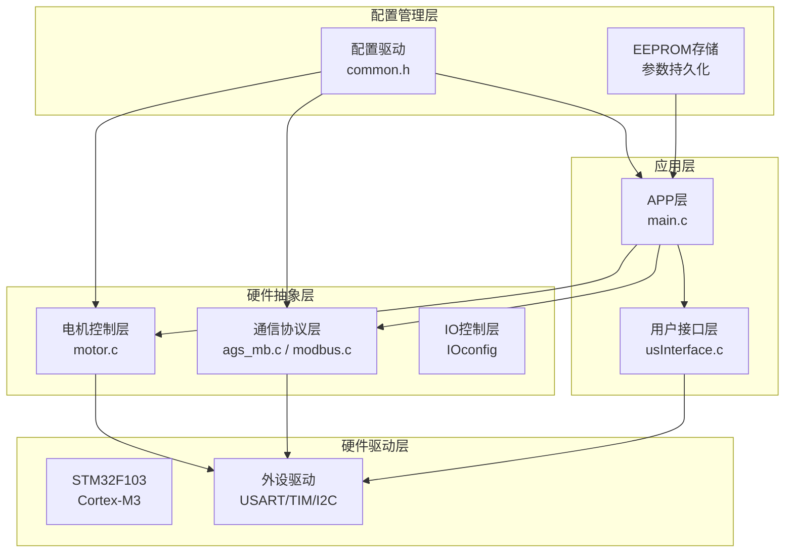
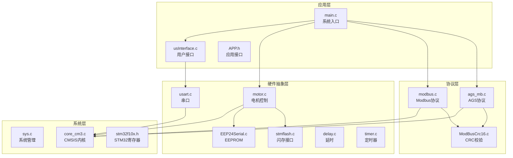
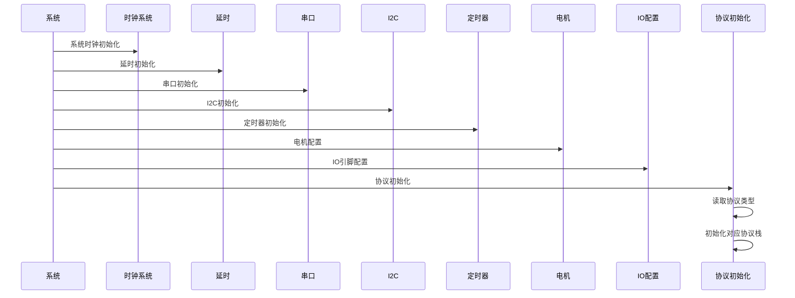
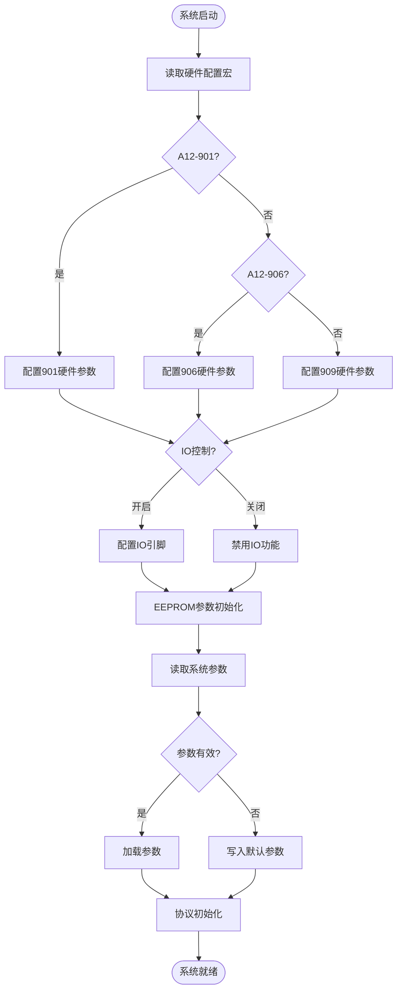
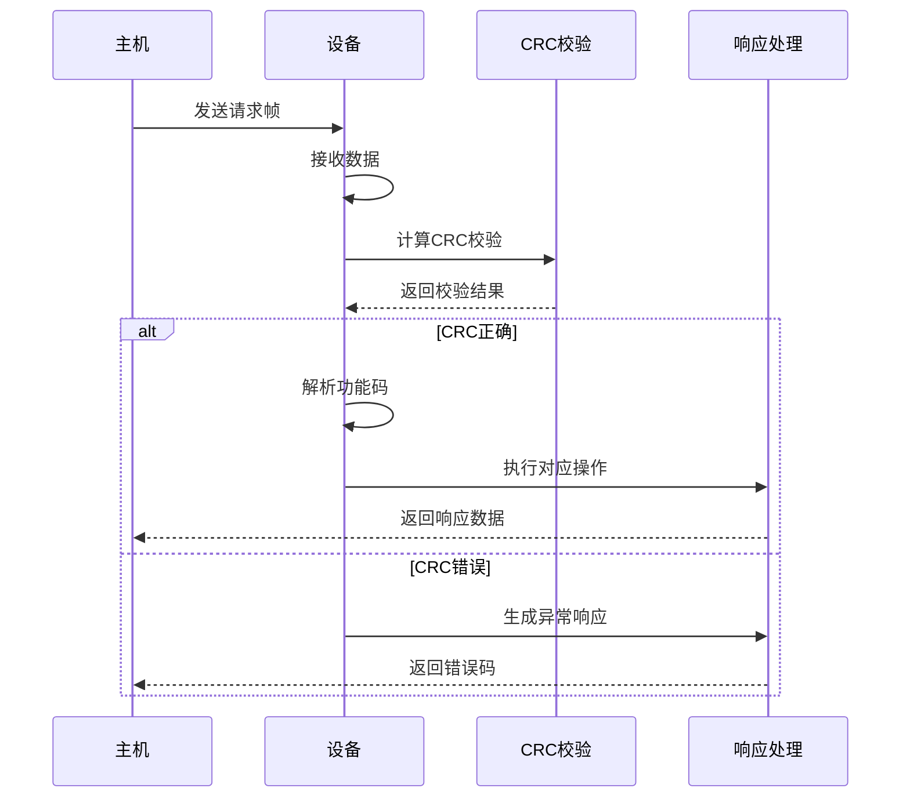
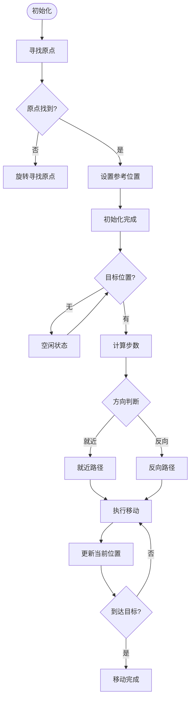
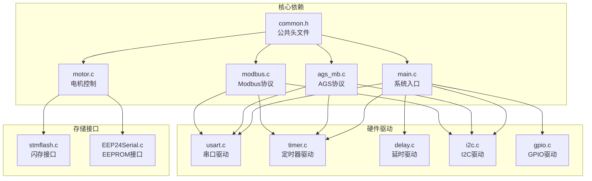

# 项目概述

<cite>
**本文档引用的文件**
- [main.c](file://SRC/APP/main.c)
- [main.h](file://SRC/APP/main.h)
- [common.h](file://SRC/APP/common.h)
- [ags_mb.c](file://SRC/HARDWARE/ags_mb/ags_mb.c)
- [ags_mb.h](file://SRC/HARDWARE/ags_mb/ags_mb.h)
- [modbus.c](file://SRC/HARDWARE/modbus/modbus.c)
- [modbus.h](file://SRC/HARDWARE/modbus/modbus.h)
- [motor.c](file://SRC/HARDWARE/motor/motor.c)
- [usInterface.c](file://SRC/HARDWARE/usinterface/usInterface.c)
- [QHF_v1.3.1修改说明.md](file://Doc/QHF_v1.3.1修改说明.md)
- [release_version.txt](file://Version/release_version.txt)
- [A_901_STM32F103C8_1.0.0.dbgconf](file://USER/DebugConfig/A_901_STM32F103C8_1.0.0.dbgconf)
</cite>

## 目录
1. [项目简介](#项目简介)
2. [项目结构](#项目结构)
3. [核心组件](#核心组件)
4. [架构总览](#架构总览)
5. [详细组件分析](#详细组件分析)
6. [依赖关系分析](#依赖关系分析)
7. [性能考虑](#性能考虑)
8. [故障排查指南](#故障排查指南)
9. [结论](#结论)
10. [附录](#附录)

## 项目简介

通用开关器项目是一个面向工业阀门控制的应用固件，基于ARM Cortex-M3内核的STM32F103系列微控制器实现。该项目的核心目标是提供一套稳定、可靠、可扩展的工业阀门控制系统，支持多硬件版本（A12-901/906/909）和双协议通信（AGS协议和Modbus协议），具备智能阀门控制、参数配置驱动、IO控制、老化测试等多种功能。

项目采用模块化分层架构设计，通过配置驱动机制实现不同硬件版本和通信协议的统一管理。系统集成了步进电机控制、EEPROM参数存储、串口通信、IO控制等功能模块，为工业自动化场景提供完整的解决方案。

## 项目结构

项目采用典型的嵌入式软件分层架构，主要分为以下层次：

**图表来源**
- [main.c:433-494](file://SRC/APP/main.c#L433-L494)
- [common.h:1-526](file://SRC/APP/common.h#L1-L526)

**章节来源**
- [main.c:433-494](file://SRC/APP/main.c#L433-L494)
- [common.h:1-526](file://SRC/APP/common.h#L1-L526)

## 核心组件

### 系统主控模块

系统主控位于APP层，负责整体协调和控制流程。主要功能包括：

- **硬件初始化**：系统时钟、延时、JTAG设置、串口初始化
- **协议选择**：根据配置选择AGS协议或Modbus协议
- **参数管理**：EEPROM参数读取、验证和写入
- **状态监控**：超时保护、错误处理、LED指示

### 通信协议模块

项目实现了两种通信协议，满足不同应用场景需求：

#### AGS协议（基于Modbus魔改）
- 支持功能码03（读保持寄存器）和06（预置单个保持寄存器）
- 提供设备地址、版本号、序列号、速度、切换次数等参数读写
- 支持广播地址查询和异常处理机制

#### Modbus协议
- 完整的Modbus RTU实现，支持功能码03、06等
- 提供保持寄存器、输入寄存器、线圈等标准Modbus数据类型
- 支持工厂模式、老化模式等特殊功能

**章节来源**
- [ags_mb.c:1-474](file://SRC/HARDWARE/ags_mb/ags_mb.c#L1-L474)
- [modbus.c:1-776](file://SRC/HARDWARE/modbus/modbus.c#L1-L776)
- [ags_mb.h:1-163](file://SRC/HARDWARE/ags_mb/ags_mb.h#L1-L163)
- [modbus.h:1-213](file://SRC/HARDWARE/modbus/modbus.h#L1-L213)

### 电机控制模块

电机控制模块负责阀门的精确控制和定位：

- **步进电机驱动**：支持细分控制、加减速控制
- **原点寻找**：自动寻找机械原点，建立参考坐标系
- **位置控制**：基于步进电机的精确定位控制
- **安全保护**：超时保护、堵转保护、急停功能

### IO控制模块

IO控制模块提供灵活的外部信号处理能力：

- **多硬件版本支持**：A12-901/906/909不同引脚配置
- **IO控制功能**：支持外部IO信号控制阀门切换
- **状态指示**：LED状态指示，支持多种工作状态显示

**章节来源**
- [motor.c:1-463](file://SRC/HARDWARE/motor/motor.c#L1-L463)
- [main.c:12-67](file://SRC/APP/main.c#L12-L67)

## 架构总览

项目采用分层架构设计，各层职责明确，耦合度低，便于维护和扩展：

**图表来源**
- [main.c:1-552](file://SRC/APP/main.c#L1-L552)
- [motor.c:1-463](file://SRC/HARDWARE/motor/motor.c#L1-L463)
- [usInterface.c:1-577](file://SRC/HARDWARE/usinterface/usInterface.c#L1-L577)

## 详细组件分析

### 系统初始化流程

系统启动时按照严格的初始化顺序执行，确保各模块正确配置：

**图表来源**
- [main.c:433-494](file://SRC/APP/main.c#L433-L494)

### 参数配置驱动机制

项目采用配置驱动的方式管理不同硬件版本和功能特性：

**图表来源**
- [common.h:42-134](file://SRC/APP/common.h#L42-L134)
- [main.c:222-429](file://SRC/APP/main.c#L222-L429)

**章节来源**
- [common.h:42-134](file://SRC/APP/common.h#L42-L134)
- [main.c:222-429](file://SRC/APP/main.c#L222-L429)

### 通信协议处理流程

两种通信协议都实现了完整的请求-响应处理流程：

**图表来源**
- [ags_mb.c:426-474](file://SRC/HARDWARE/ags_mb/ags_mb.c#L426-L474)
- [modbus.c:469-517](file://SRC/HARDWARE/modbus/modbus.c#L469-L517)

**章节来源**
- [ags_mb.c:426-474](file://SRC/HARDWARE/ags_mb/ags_mb.c#L426-L474)
- [modbus.c:469-517](file://SRC/HARDWARE/modbus/modbus.c#L469-L517)

### 电机控制算法

电机控制采用先进的步进电机控制算法，确保精确的位置控制和良好的动态性能：

**图表来源**
- [motor.c:73-351](file://SRC/HARDWARE/motor/motor.c#L73-L351)

**章节来源**
- [motor.c:73-351](file://SRC/HARDWARE/motor/motor.c#L73-L351)

## 依赖关系分析

项目采用模块化设计，各模块之间的依赖关系清晰明确：

**图表来源**
- [common.h:155-173](file://SRC/APP/common.h#L155-L173)
- [main.c:1-552](file://SRC/APP/main.c#L1-L552)

**章节来源**
- [common.h:155-173](file://SRC/APP/common.h#L155-L173)
- [main.c:1-552](file://SRC/APP/main.c#L1-L552)

## 性能考虑

项目在设计时充分考虑了实时性和可靠性要求：

### 实时性能优化
- **中断优先级**：合理配置中断优先级，确保关键任务及时响应
- **定时器配置**：使用高精度定时器实现精确的时间控制
- **DMA传输**：利用DMA进行串口数据传输，减少CPU占用

### 内存管理
- **静态分配**：关键数据结构采用静态分配，避免运行时内存碎片
- **堆栈优化**：合理配置堆栈大小，防止栈溢出
- **内存对齐**：确保数据结构按要求对齐，提高访问效率

### 通信优化
- **CRC校验**：采用高效的CRC16算法，确保数据完整性
- **超时处理**：完善的超时机制，防止系统阻塞
- **缓冲管理**：合理的缓冲区大小和管理策略

## 故障排查指南

### 常见问题诊断

#### 通信故障
- **现象**：设备无响应或响应异常
- **排查步骤**：
  1. 检查串口配置（波特率、数据位、停止位）
  2. 验证设备地址设置
  3. 确认CRC校验正确性
  4. 检查物理连接质量

#### 电机不动作
- **现象**：电机发出响声但不转动
- **排查步骤**：
  1. 检查电源电压和电流
  2. 验证电机驱动器配置
  3. 确认限位开关状态
  4. 检查步进脉冲信号

#### 参数丢失
- **现象**：重启后参数恢复默认值
- **排查步骤**：
  1. 检查EEPROM写入权限
  2. 验证EEPROM容量和寿命
  3. 确认写入时序正确性
  4. 检查电源稳定性

**章节来源**
- [main.c:169-202](file://SRC/APP/main.c#L169-L202)
- [motor.c:376-463](file://SRC/HARDWARE/motor/motor.c#L376-L463)

## 结论

通用开关器项目通过精心设计的分层架构和模块化组织，成功实现了工业阀门控制系统的完整解决方案。项目的主要优势包括：

1. **多硬件版本支持**：通过配置驱动机制，统一支持A12-901/906/909三种硬件版本
2. **双协议通信**：同时支持AGS协议和Modbus协议，满足不同应用场景需求
3. **智能控制算法**：采用先进的步进电机控制算法，确保精确的位置控制
4. **配置驱动机制**：通过宏定义和配置文件实现灵活的功能定制
5. **完善的保护机制**：包含超时保护、堵转保护、急停等功能

项目在性能、可靠性、可维护性方面都达到了工业级标准，为后续的功能扩展和应用推广奠定了坚实基础。

## 附录

### 版本演进历史

项目经历了多个重要版本迭代，每个版本都针对特定需求进行了优化和改进：

- **v1.3.1-r27**：支持Modbus协议，修复485串口接收问题
- **v1.3.1-r21**：优化显示和调试功能
- **多版本支持**：A/B/C三种版本，支持不同IO配置标准

### 硬件平台支持

项目支持多种硬件平台和配置组合：

- **A12-901**：最小版本，支持2.6A最大电流
- **A12-906**：水平版本，支持2.5A最大电流  
- **A12-909**：垂直版本，支持2.2A最大电流

### 开发环境配置

项目使用Keil MDK开发环境，支持自动化编译和版本管理：

- **编译工具**：Keil UV4
- **目标平台**：STM32F103系列
- **版本管理**：自动化编译脚本和版本控制

**章节来源**
- [QHF_v1.3.1修改说明.md:1-190](file://Doc/QHF_v1.3.1修改说明.md#L1-L190)
- [release_version.txt:1-961](file://Version/release_version.txt#L1-L961)
- [A_901_STM32F103C8_1.0.0.dbgconf:1-37](file://USER/DebugConfig/A_901_STM32F103C8_1.0.0.dbgconf#L1-L37)