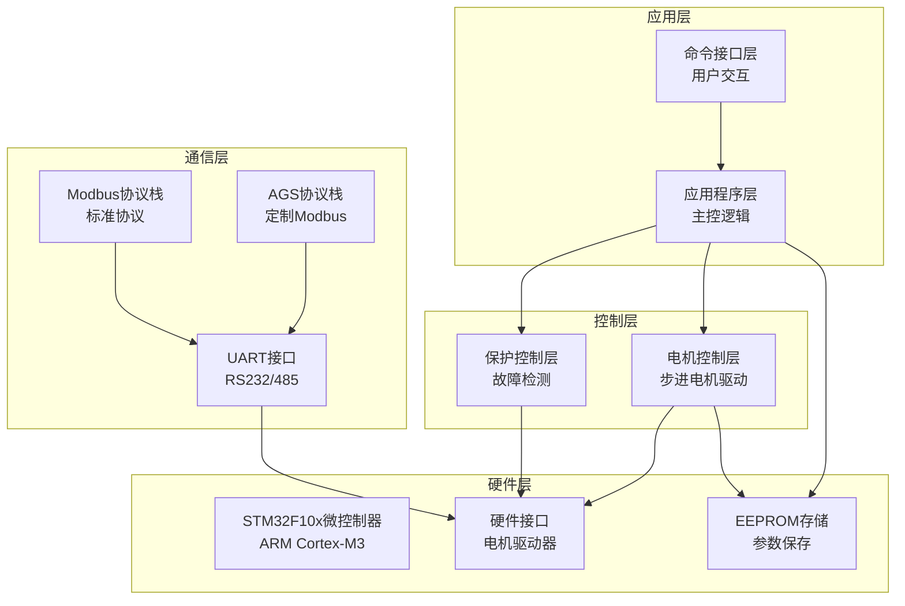
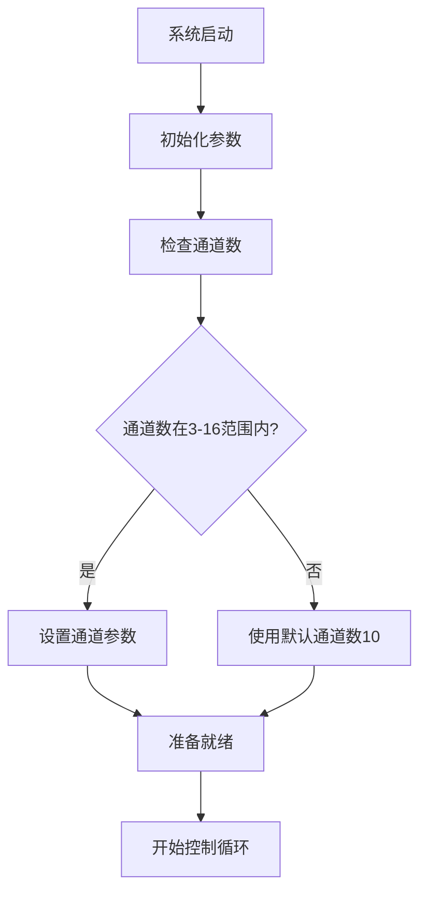
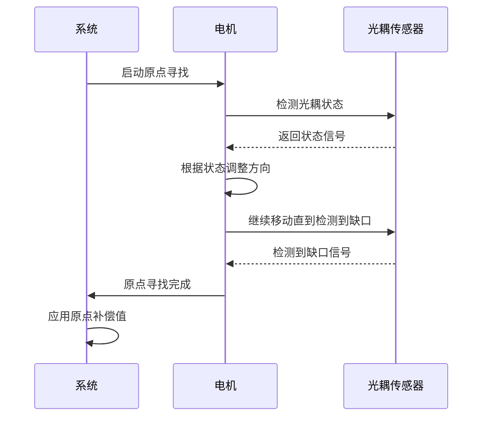
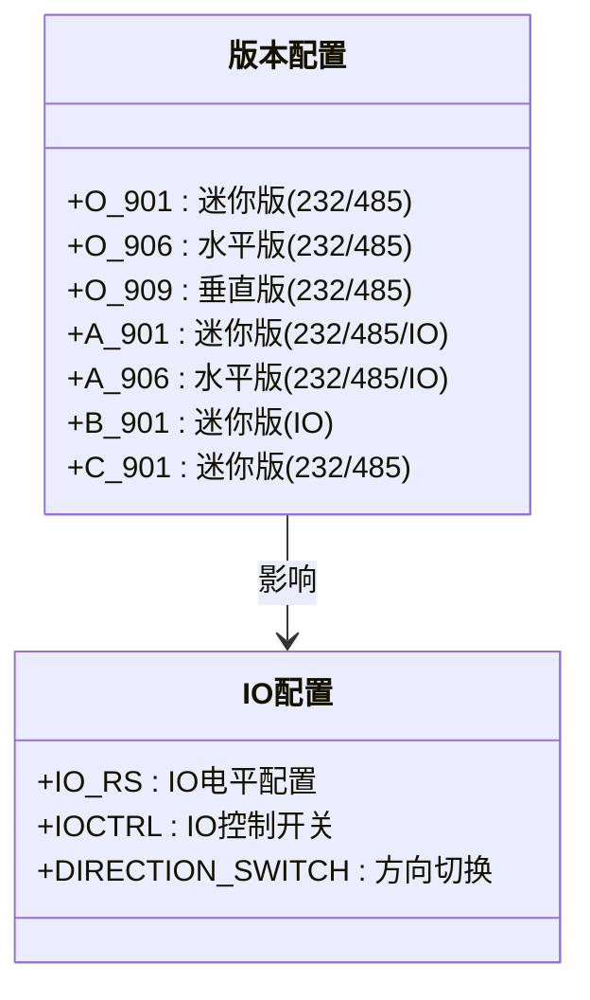
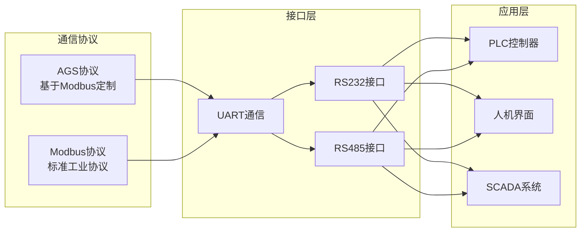
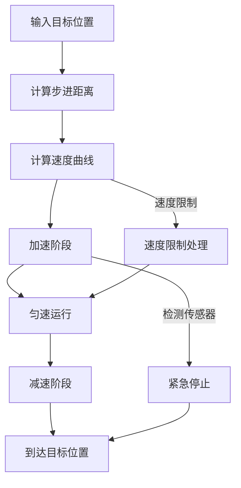
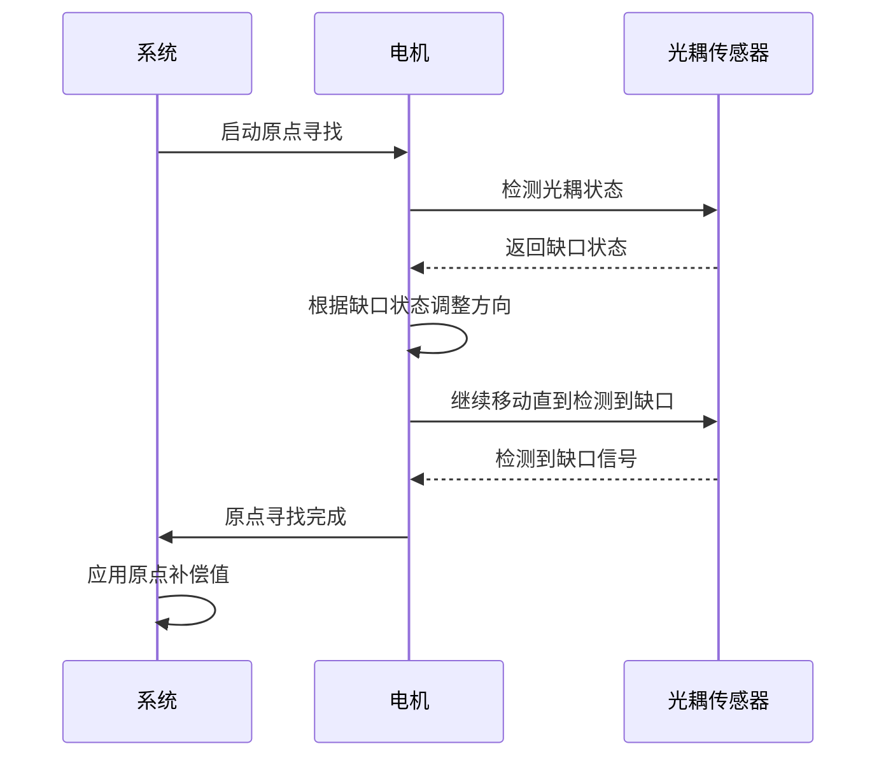
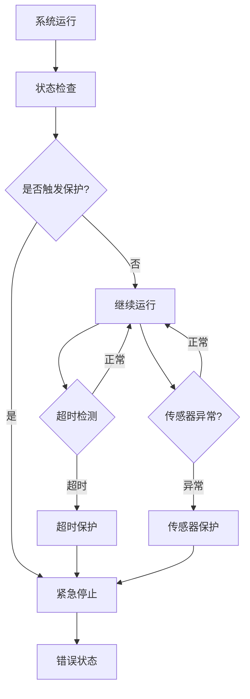

# 项目简介

<cite>
**本文引用的文件**
- [main.c](file://SRC/APP/main.c)
- [main.h](file://SRC/APP/main.h)
- [common.h](file://SRC/APP/common.h)
- [motor.c](file://SRC/HARDWARE/motor/motor.c)
- [smotor.h](file://SRC/HARDWARE/motor/smotor.h)
- [ags_mb.c](file://SRC/HARDWARE/ags_mb/ags_mb.c)
- [modbus.c](file://SRC/HARDWARE/modbus/modbus.c)
- [usinterface.h](file://SRC/HARDWARE/usinterface/usinterface.h)
- [QHF_v1.3.1修改说明.md](file://Doc/QHF_v1.3.1修改说明.md)
</cite>

## 目录
1. [项目概述](#项目概述)
2. [核心目标与应用场景](#核心目标与应用场景)
3. [技术架构与系统组成](#技术架构与系统组成)
4. [关键功能特性](#关键功能特性)
5. [硬件平台与多版本支持](#硬件平台与多版本支持)
6. [通信协议与参数配置](#通信协议与参数配置)
7. [智能控制算法](#智能控制算法)
8. [故障保护与安全机制](#故障保护与安全机制)
9. [版本演进与技术创新](#版本演进与技术创新)
10. [总结](#总结)

## 项目概述

通用开关器（通用阀门控制系统）是一个专为工业自动化设计的多通道阀门定位控制系统。该项目基于STM32F10x系列微控制器开发，实现了3-16通道阀门的精确控制，支持智能原点寻找和方向补偿功能，提供双协议通信能力（AGS协议和Modbus协议）。

该系统针对工业自动化控制中的核心挑战而设计，包括阀门定位精度、通信可靠性、多硬件版本兼容性等问题，为现代工业控制系统提供了完整的解决方案。

## 核心目标与应用场景

### 主要目标
- **多通道精确控制**：支持3-16通道阀门的独立控制，满足复杂工业系统的多点控制需求
- **高精度定位**：通过步进电机驱动实现阀门的精确定位，确保控制精度达到工业应用要求
- **智能原点寻找**：自动化的原点识别和校准功能，减少人工干预
- **双向通信支持**：同时支持AGS协议和Modbus协议，适应不同工业环境的通信需求

### 应用场景
- **石油化工行业**：管道阀门的精确控制和监控
- **电力系统**：冷却水阀门、给排水系统的自动化控制
- **冶金工业**：高温高压环境下的阀门控制
- **市政工程**：给排水管网的智能化管理
- **食品饮料**：卫生级阀门的精确控制

## 技术架构与系统组成

### 整体架构图

**图表来源**
- [main.c:433-494](file://SRC/APP/main.c#L433-L494)
- [motor.c:4-68](file://SRC/HARDWARE/motor/motor.c#L4-L68)

### 核心组件关系

系统采用分层架构设计，各组件职责明确，相互协作：

1. **应用程序层**：负责整体逻辑控制和状态管理
2. **电机控制层**：实现步进电机的精确控制
3. **通信协议层**：提供多种通信协议支持
4. **硬件抽象层**：屏蔽硬件差异，提供统一接口

**章节来源**
- [main.c:433-494](file://SRC/APP/main.c#L433-L494)
- [common.h:155-169](file://SRC/APP/common.h#L155-L169)

## 关键功能特性

### 多通道阀门控制

系统支持3-16通道的独立阀门控制，每通道具备独立的状态监测和控制能力：

**图表来源**
- [main.c:246-253](file://SRC/APP/main.c#L246-L253)
- [main.h:127-182](file://SRC/APP/main.h#L127-L182)

### 智能原点寻找与方向补偿

系统实现了智能化的原点寻找算法，结合方向补偿功能：

**图表来源**
- [motor.c:73-268](file://SRC/HARDWARE/motor/motor.c#L73-L268)

**章节来源**
- [motor.c:73-268](file://SRC/HARDWARE/motor/motor.c#L73-L268)

## 硬件平台与多版本支持

### 硬件版本支持

系统支持多种硬件版本，通过宏定义实现灵活配置：

| 硬件版本 | 最大电流 | 描述 | 引脚配置 |
|---------|---------|------|----------|
| A12-901 | 1.6A | 迷你版 | 232/485+IO |
| A12-906 | 2.5A | 水平版 | 232/485+IO |
| A12-909 | 2.2A | 垂直版 | 232/485+IO |

### 版本宏定义

**图表来源**
- [common.h:49-133](file://SRC/APP/common.h#L49-L133)

**章节来源**
- [common.h:49-133](file://SRC/APP/common.h#L49-L133)
- [QHF_v1.3.1修改说明.md:8-16](file://Doc/QHF_v1.3.1修改说明.md#L8-L16)

## 通信协议与参数配置

### 双协议支持架构

系统同时支持两种通信协议，提供灵活的通信方案：

**图表来源**
- [ags_mb.c:7-73](file://SRC/HARDWARE/ags_mb/ags_mb.c#L7-L73)
- [modbus.c:35-67](file://SRC/HARDWARE/modbus/modbus.c#L35-L67)

### 参数远程配置能力

系统提供全面的远程参数配置功能：

| 参数类别 | 配置项 | 范围 | 默认值 | 功能说明 |
|---------|--------|------|--------|----------|
| 基础参数 | 地址 | 0-63 | 1 | 设备通信地址 |
| 基础参数 | 通道数 | 3-16 | 10 | 阀门通道数量 |
| 基础参数 | 速度 | 20-200 | 20 | 阀门移动速度 |
| 基础参数 | 波特率 | 1-3 | 1(9600) | 通信波特率 |
| 基础参数 | 半通道 | 0/1 | 0 | 半通道功能开关 |
| 减速参数 | 减速比 | 1/4/10/16/20 | 4 | 传动减速比 |
| 电流参数 | 电流设置 | 0-4 | 0 | 电机驱动电流 |

**章节来源**
- [ags_mb.c:182-285](file://SRC/HARDWARE/ags_mb/ags_mb.c#L182-L285)
- [modbus.c:523-568](file://SRC/HARDWARE/modbus/modbus.c#L523-L568)

## 智能控制算法

### 步进电机控制算法

系统采用先进的步进电机控制算法，实现精确的位置控制：

**图表来源**
- [smotor.h:67-95](file://SRC/HARDWARE/motor/smotor.h#L67-L95)

### 原点寻找算法

**图表来源**
- [motor.c:356-371](file://SRC/HARDWARE/motor/motor.c#L356-L371)

**章节来源**
- [motor.c:275-351](file://SRC/HARDWARE/motor/motor.c#L275-L351)

## 故障保护与安全机制

### 多层次保护机制

系统实现了多层次的安全保护机制：

**图表来源**
- [main.c:180-201](file://SRC/APP/main.c#L180-L201)

### 保护机制详情

1. **超时保护**：单次运行超时保护（5秒），初始化超时保护（14秒）
2. **传感器保护**：光耦传感器异常检测和保护
3. **急停保护**：原点和端点光耦信号触发的急停功能
4. **通信保护**：通信超时和错误处理机制

**章节来源**
- [main.c:180-201](file://SRC/APP/main.c#L180-L201)
- [motor.c:356-371](file://SRC/HARDWARE/motor/motor.c#L356-L371)

## 版本演进与技术创新

### 版本发展历程

系统经历了多个重要版本演进，每个版本都带来了技术创新：

| 版本 | 时间 | 主要改进 | 技术创新 |
|------|------|----------|----------|
| v1.2.9 | 2024.09.26 | 原点补偿优化 | 减速区间原点补偿 |
| v1.3.0 | 2025.01.14 | 通信稳定性提升 | 通信丢包修复 |
| v1.3.1 | 2025.06.26 | IO功能统一 | A/B版本统一 |
| v1.3.1A/B-r27 | 2026.04.22 | Modbus支持 | 双协议通信 |

### 技术创新亮点

1. **双协议支持**：同时支持AGS协议和Modbus协议，适应不同工业环境
2. **智能参数配置**：支持远程参数配置和范围验证
3. **多硬件版本兼容**：通过宏定义实现多硬件版本的统一支持
4. **故障保护机制**：多层次的故障检测和保护机制
5. **通信优化**：改进的通信协议栈和错误处理机制

**章节来源**
- [QHF_v1.3.1修改说明.md:50-170](file://Doc/QHF_v1.3.1修改说明.md#L50-L170)

## 总结

通用开关器项目是一个功能完整、技术先进的工业阀门控制系统。通过采用多通道控制、智能原点寻找、双协议通信等核心技术，有效解决了工业自动化控制中的关键问题。

### 主要优势

1. **高精度控制**：步进电机驱动实现精确的阀门定位控制
2. **灵活配置**：支持远程参数配置和多硬件版本兼容
3. **可靠通信**：双协议支持确保通信的稳定性和兼容性
4. **安全保障**：多层次的故障保护机制确保系统安全运行
5. **扩展性强**：模块化设计便于功能扩展和维护升级

### 技术价值

该系统为工业自动化领域提供了成熟的解决方案，具有重要的技术价值和应用前景。通过持续的技术创新和功能完善，必将在工业控制系统中发挥重要作用。